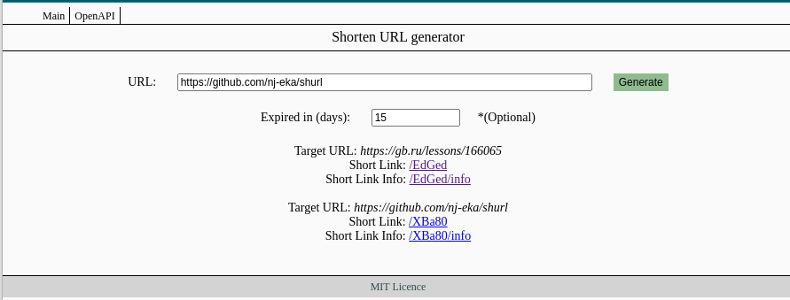
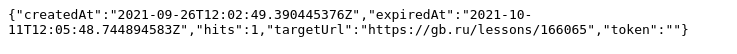
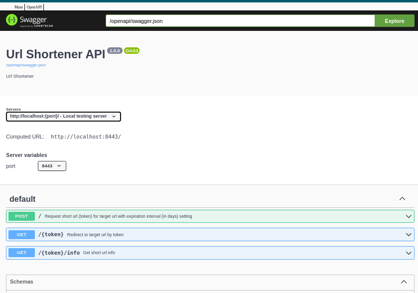

# shurl
URL Shortener - Goland full stack web application in the form of a web service with primitive ui (as part of a course project of golang backend system)

## Main Features

- Basic functionality of this kind of services is implemented:
  - Url shortening
  - Short url redirection
  - Click rate statistics
  - Expirable links
  - Url deletion
- Framework supports easy extensibility with flexible configuration based on adopting best practices + design principles with usage of the following components and technologies:
  - RESTfull API
    - [openapi v3.0.3](https://swagger.io/specification/)
    - type, spec, chi-server generated by [oapi-codegen](https://github.com/deepmap/oapi-codegen)
    - swagger ui (**.../opeanapi** entry point)
  - Http requests handling with [go-chi](https://github.com/go-chi/chi) - lightweight, idiomatic and composable router for building Go HTTP services
  - Configurable token generation
    - using [hashid](https://hashids.org/) algo with customizable alphabet, length and salt
    - simple interface and quick replacement in config file.
  - Multiple supported storage backends
    - maps in memory (with saving results between application launches) - the fastest option
    - embedded in-memory high performance local database with [bolt](https://github.com/boltdb/bolt) using [storm](https://github.com/asdine/storm) powerful toolkit
  - Flexible multifactorial logging using [logrus](https://github.com/sirupsen/logrus)
  - Comprehensive errors identification
  - Dockerized
  - Full CI/CD workflow integration with [heroku](https://www.heroku.com/)
- Open source

## Installation
    $ git clone https://github.com/nj-eka/shurl.git
    $ cd shurl
### run locally
    $ make run

### run in docker container
    $ docker build -f Dockerfile -t shurl_image .
    $ docker run -p 8443:8443 --rm -it shurl_image

### run on heroku platform (main road)
    $ heroku login
    $ heroku stack:set container -a [heroku_app_name]
    $ heroku container:login
    $ docker tag shurl_image:latest registry.heroku.com/[heroku_app_name]/web
    $ docker push registry.heroku.com/[heroku_app_name]/web
    $ heroku container:release web
    $ heruku open

## Configuration and usage:
### Usage:
```sh
$ shurl [OPTIONS]
OPTIONS:
  --env-prefix  - env prefix; default: (appName)
  --env         - path to .env file (to simplify deployment procedure) default: .env (pwd)
  --config      - path to config file; default: (appName).yml
  --save-config - path to save current resolved config
```
### Config file example:
```
shutdown-timeout: 30s
server:
  host: "0.0.0.0"
  port: 8443
  timeout: 3s
router:
  web-path: "web"
logging:
  path: "shurl.log"
  level: debug
  format: text
store:
  bolt:
    path: "links.db"
    timeout: 1s
tokenizer:
  hashid:
    salt: "ecafbaf0-1bcc-11ec-9621-0242ac130002"
    min-length: 5
    alphabet: "0123456789_abcdefghijklmnopqrstuvwxyzABCDEFGHIJKLMNOPQRSTUVWXYZ"
```
### Environment variables (optional):
```
#SHURL == --env-prefix
SHURL_LOGGING_PATH="path/to/log.file" 
SHURL_LOGGING_LEVEL="info" # debug, warn, error, critical
SHURL_SERVER_HOST="localhost"
SHURL_SERVER_PORT=(tcp.port) == PORT as alias (heroku specific)
SHURL_STORE_BOLT_PATH="path/to/bolt.db"
SHURL_TOKENIZER_SALT="unique string for your token generator"
SHURL_ROUTER_WEB_PATH="path/to/web_dir"
```
### User interface (screenshots):




## Ideas for futures:
- Extend functionality in the following ways:
  - Add link alias
  - Change the destination URL for any short link, including QR Codes;
  - Create secure & reliable links:
    - Implement multiple authorization strategies:
      - mainly: local authorization via OAuth 2.0 (Google, GitHub etc)
      - deal with proxy authorization for running behind e.g. Google IAP
      - auth make token to be user proprietary (when token depends on []int {user_id, rec_id})
    - use https protocol
  - Add UTM labels
  - Leverage key real-time data points on every click;
  - Keep track of link history
- Persistent non-local storage 
  - with [redis](https://redis.io/)
  - with PostgreSQL

*Contributions and bug reports are welcome.*
